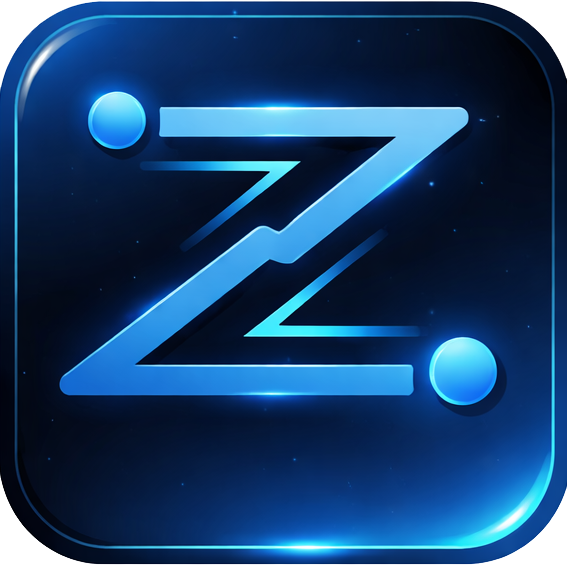
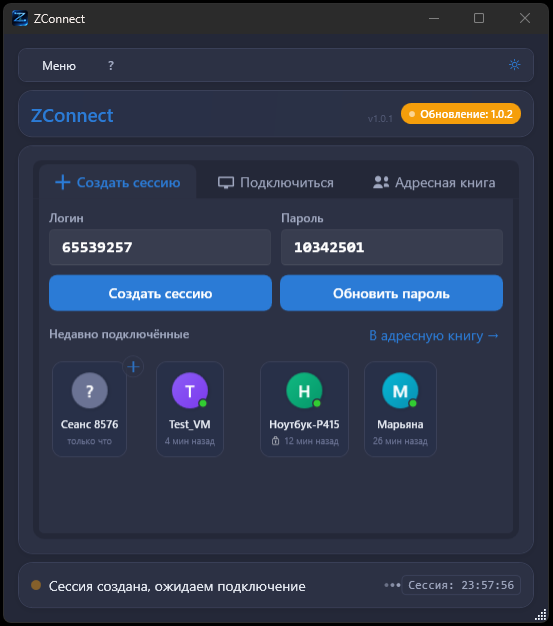
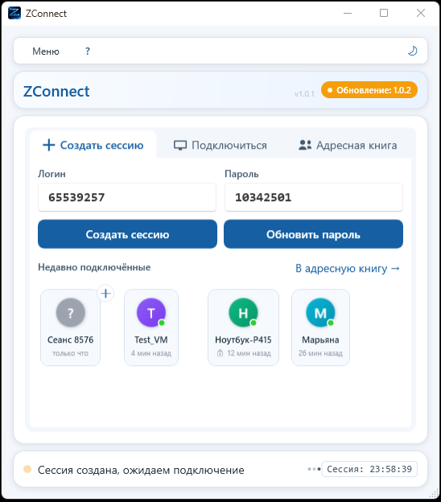
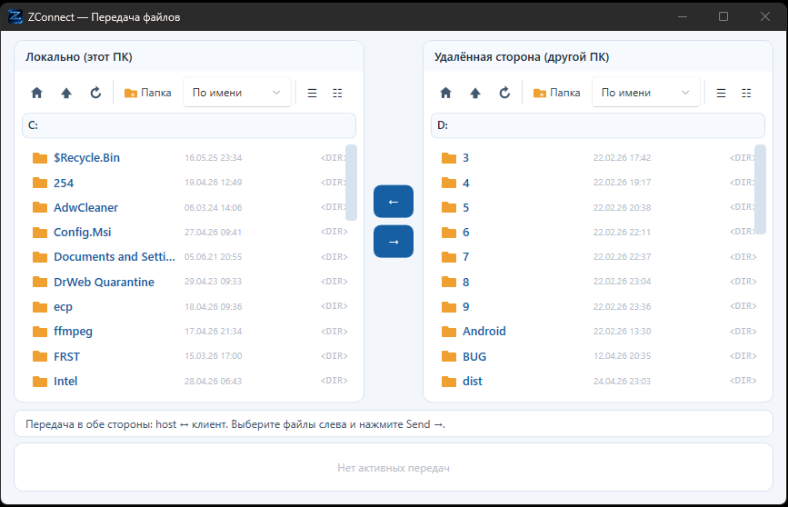
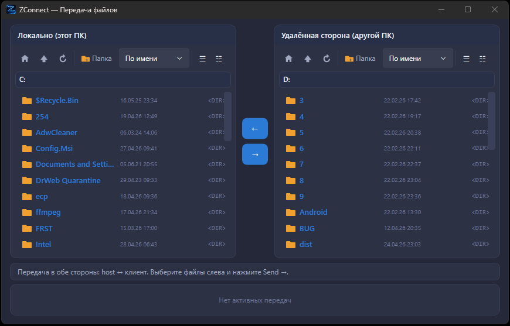
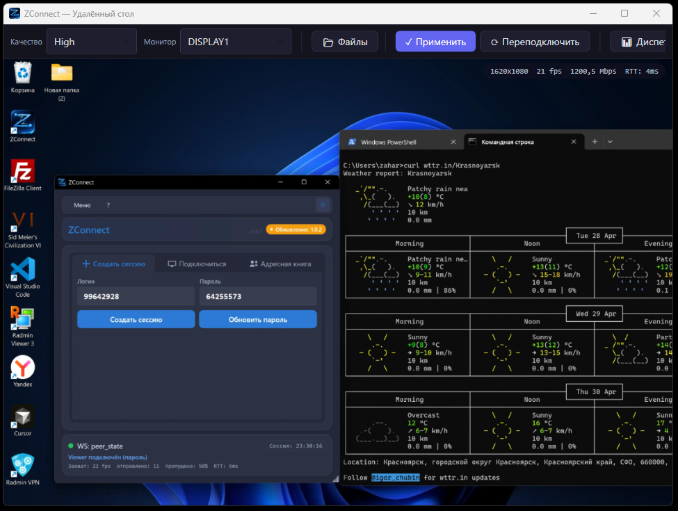

<p align="center">
  
</p>

<h1 align="center">ZConnect</h1>

<p align="center">
  <b>Self-hosted remote desktop. P2P over WebRTC. Your data stays yours.</b><br>
  Free · MIT · Windows + Android · No cloud, no subscription, no telemetry of session content.
</p>

<p align="center">
  <a href="https://github.com/zahar24ru/ZConect/releases"></a>
  <a href="LICENSE"></a>
  
  
  
  
  
</p>

<p align="center">
  <a href="https://zconn.ru/">Website</a> ·
  <a href="docs/ARCHITECTURE.md">Architecture</a> ·
  <a href="docs/DEPLOY_GUIDE.md">Deploy guide</a> ·
  <a href="https://t.me/zahar24ru">Telegram</a>
</p>

---

<p align="center">
  
</p>

## What is ZConnect?

ZConnect is a **free, open-source, self-hosted remote desktop tool** for Windows. Unlike commercial alternatives — TeamViewer, AnyDesk, RustDesk hosted instances — your video, files, keystrokes and clipboard go **directly between two PCs** via WebRTC. Your signaling server (which only helps the two PCs find each other) runs on your VPS. There is no third-party cloud.

**How it works.** Host clicks "Create Session", gets two 8-digit codes, shares them with the viewer. Viewer enters the codes, clicks "Connect". The two PCs exchange addresses through your signaling server, then a direct WebRTC connection is established. Video, input, files and clipboard flow peer-to-peer. The server does **not** see the contents of the session.

---

## Why ZConnect

| | ZConnect | TeamViewer / AnyDesk | RustDesk hosted |
|---|---|---|---|
| **Self-hosted** | ✅ Your VPS, your DB, your auth | ❌ Their cloud | ⚠️ Optional (paid) |
| **Cost** | ✅ Free, MIT | 💰 $30+/month | 💰 from $9/month |
| **P2P** | ✅ Direct WebRTC | ⚠️ Routed via their servers | ⚠️ Routed via theirs |
| **Source code** | ✅ Open | ❌ Proprietary | ✅ Open |
| **Vendor lock-in** | ✅ None | ❌ Account required | ⚠️ Hosted version |
| **Telemetry** | ✅ Anonymous heartbeat only ([details](docs/PRIVACY_POLICY.md)) | ❌ Full session telemetry | varies |

**Tradeoff:** you maintain a small VPS (1 vCPU, 2 GB RAM is enough). Setup is a single PowerShell command, ~20 seconds.

---

## Try it now (community server)

Don't want to deploy your own VPS yet? Use the community server `connect.zconn.ru` — preconfigured in the installer. Download, install, click "Create Session", connect from a second PC. You can move to your own VPS later by changing the URL in *Settings → System*.

📥 [Download installer (zconn.ru)](https://zconn.ru/) · 11.8 MB · Windows 10 / 11 · .NET 8 runtime auto-installed

---

## Features

| | Feature | Details |
|---|---|---|
| 🖥️ **Remote Desktop** | Screen sharing | DXGI Output Duplication, multi-monitor stitching, GDI fallback on secure desktop, adaptive quality (Auto / Low / Medium / High) |
| 🖱️ **Input** | Mouse + keyboard | Full remote control with cursor shape sync. UAC clicks via SYSTEM-integrity helper |
| 📁 **File Transfer** | Two-panel manager | Upload + download (recursive folders), drag & drop, pause/resume/cancel, conflict resolution, F2 rename, Ctrl+Shift+N new folder |
| 📋 **Clipboard** | Text sync | Bidirectional, 256 KB UTF-8 limit, echo protection |
| 🔐 **Security** | End-to-end | Session ownership auth, DPAPI + EncryptedSharedPreferences, path traversal protection, progressive lockout 15s→2m→15m→1h→permanent, rate limiting |
| 🌐 **NAT traversal** | ICE auto-mode | LAN → STUN → TURN, multi-TURN failover, ICE restart on Failed, force-relay toggle |
| 🔑 **TURN credentials** | Rotating | RFC 7635 short-term creds, 30 min TTL, per-client unique. Leaked creds expire automatically |
| 🌍 **Localization** | UI language | Russian + English (~220 string keys), installer picker, switch in settings |
| 📱 **Android viewer** | Production-ready | Touch gestures (double-click, hold-drag, zoom pan), per-contact saved password, lockout countdown timer |
| 🔒 **Privacy by design** | Anonymous telemetry | Only `machine_id + version + country` heartbeat. No login codes, no session content, no clipboard data on server. [Privacy Policy](docs/PRIVACY_POLICY.md) |

---

## Screenshots

<table>
<tr>
<td></td>
<td></td>
</tr>
<tr>
<td align="center"><sub>Main window — light theme</sub></td>
<td align="center"><sub>Main window — dark theme</sub></td>
</tr>
<tr>
<td></td>
<td></td>
</tr>
<tr>
<td align="center"><sub>File transfer — two-panel manager</sub></td>
<td align="center"><sub>File transfer — dark theme</sub></td>
</tr>
</table>

<p align="center">
  
  <br><sub>Remote desktop session — multi-monitor capture, quality overlay (Ctrl+I), file transfer toggle</sub>
</p>

---

## Quick Start

### 1. Deploy the signaling server

You need an Ubuntu 24 LTS VPS (1 vCPU, 2 GB RAM is enough). Docker is installed automatically by the setup script.

**Mode A — HTTPS production** (recommended). Requires a domain pointing to your VPS:

```powershell
powershell -ExecutionPolicy Bypass -File .\deploy\deploy_setup.ps1 `
  -VpsIp YOUR_SERVER_IP `
  -SshUser root `
  -TurnPass "your-turn-password" `
  -PublicIpv4 YOUR_SERVER_IP `
  -AdminPasswordHash '$2a$12$...' `
  -Domain connect.example.com `
  -AdminEmail you@example.com
```

Caddy auto-provisions a Let's Encrypt certificate and renews every 60 days. HSTS + secure cookies on by default. Result: signaling on `https://connect.example.com`.

**Mode B — HTTP** (LAN / dev / testing only):

```powershell
powershell -ExecutionPolicy Bypass -File .\deploy\deploy_setup.ps1 `
  -VpsIp YOUR_SERVER_IP `
  -SshUser root `
  -TurnPass "your-turn-password" `
  -PublicIpv4 YOUR_SERVER_IP `
  -AdminPasswordHash '$2a$12$...'
```

⚠️ Mode B sends codes in plaintext over HTTP. Not for public deployments.

**Daily updates** (10–20 sec, both modes):
```powershell
.\deploy\deploy_fast.ps1 -VpsIp YOUR_SERVER_IP
```

Full guide: [deploy/README.md](deploy/README.md) · Step-by-step for beginners: [docs/DEPLOY_GUIDE.md](docs/DEPLOY_GUIDE.md)

### 2. Build the Windows client

```powershell
dotnet build client/UiApp/UiApp.sln -c Release -r win-x64
```

Or grab the prebuilt installer from `installer/output/ZConnect-Setup-1.0.1.exe` (after running `installer/build.ps1`).

### 3. Connect

1. **Host PC** — Launch ZConnect → click **"Create Session"**. You'll see a login + password.
2. **Viewer PC** — Launch ZConnect → enter the codes → click **"Connect"**.
3. The remote desktop window opens. Done.

---

## Android viewer

Compatible Android viewer — view-only mode (no Android-host capture; just connect to a Windows host from your phone).

- Touch gestures: double-click → 2× tap; long-press → hold-drag; pinch zoom + 2-finger pan when zoomed
- Rotating TURN credentials apply on reconnect
- Per-contact saved password — silent reconnect via EncryptedSharedPreferences (AES-256-GCM, key in Android Keystore)
- HTTPS-by-default, lifecycle-aware Flow collection, shared OkHttpClient pool
- Localized RU/EN (110+ keys)

Build: `cd android && ./gradlew assembleRelease` (requires JDK 21 + Android SDK 34).

---

## Architecture

```
┌──────────────┐         ┌────────────────────┐         ┌──────────────┐
│   Host PC    │◄───P2P──►│  Signaling + TURN  │◄───P2P──►│  Viewer PC   │
│  (Windows)   │  WebRTC  │  (Ubuntu / Docker) │  WebRTC  │  Win/Android │
│              │          │                    │          │              │
│ Screen cap   │          │ /api/v1/session/*  │          │ Remote view  │
│ Input inject │          │ /ws (signaling)    │          │ Input send   │
│ File serve   │          │ coturn 4.6 (3478)  │          │ File browse  │
└──────────────┘          └────────────────────┘          └──────────────┘
        ▲                                                          ▲
        └─────────── direct WebRTC media + DataChannels ───────────┘
                    (video, input, clipboard, file)
```

- **Client:** Three-process Windows design (Service [SYSTEM] + UI [user token, WPF .NET 8] + InputHelper [winlogon token]). [Microsoft.MixedReality.WebRTC 2.0.2](https://github.com/microsoft/MixedReality-WebRTC).
- **Server:** Go 1.25, stateless HTTP + WebSocket signaling + telemetry dashboard (SQLite). Caddy 2 reverse proxy for HTTPS.
- **Video:** VP8 via DXGI Output Duplication (dirty rects, double buffering, GDI fallback on Win+L / UAC secure desktop).
- **Transport:** WebRTC DataChannels — `dc-control`, `dc-input`, `dc-clipboard`, `dc-file`.
- **Local IPC:** Named pipes with SID verification + helper-pipe with SYSTEM-only ACL — see [PIPE_PROTOCOL.md](docs/PIPE_PROTOCOL.md).

---

## Documentation

| Doc | What it covers |
|---|---|
| [Architecture](docs/ARCHITECTURE.md) | Three-process design, threading, data channels, pipe protocol summary |
| [API contracts](docs/API.md) | HTTP endpoints, WebSocket protocol, data channel messages |
| [Pipe protocol](docs/PIPE_PROTOCOL.md) | Internal IPC (Service ↔ UI ↔ InputHelper) |
| [Deployment guide](docs/DEPLOY_GUIDE.md) | Beginner Ubuntu VPS step-by-step from zero |
| [Deployment from Windows](docs/DEPLOY_FROM_WINDOWS.md) | One-command deploy reference |
| [Server setup](deploy/README.md) | HTTP vs HTTPS decision guide, deploy scripts reference |
| [TURN rotation](docs/TURN_ROTATION.md) | RFC 7635 short-term TURN credentials design |
| [Windows Service](docs/SERVICE.md) | Auto-start, session management, UAC support |
| [Client settings](docs/CLIENT_SETTINGS.md) | Configuration reference, file paths, DPAPI scope |
| [Localization](docs/LOCALIZATION.md) | i18n setup, how to add strings, RU/EN coverage |
| [Logging](docs/LOGGING.md) | Format, rotation, key events |
| [Privacy policy](docs/PRIVACY_POLICY.md) | What's collected (heartbeat fields, IP-based country), 152-FZ compliance |
| [Roadmap](docs/ROADMAP.md) | Iteration history + future plans |
| [Implementation status](docs/IMPLEMENTATION_STATUS.md) | Current state of each component |
| [Changelog](CHANGELOG.md) | Version history |

---

## Server configuration

| Variable | Default | Description |
|---|---|---|
| `SIGNALING_PORT` | 8080 | HTTP / WebSocket port |
| `SESSION_TTL_SEC` | 300 | Session lifetime in seconds |
| `MAX_JOIN_ATTEMPTS` | 5 | Failed joins before progressive lockout |
| `LOCK_MINUTES` | 10 | First-tier lockout duration |
| `APP_ENV` | dev | `prod` enables strict security headers |
| `ALLOWED_ORIGINS` | (empty) | WebSocket CORS origins |
| `TRUSTED_PROXIES` | (empty) | CIDRs allowed to set X-Forwarded-For |
| `RATE_LIMIT_PER_MIN` | 200 | Max API requests per IP per minute |
| `DASHBOARD_API_KEY` | (empty) | API key gate for telemetry dashboard |
| `TELEMETRY_DB_PATH` | telemetry.db | SQLite database path |
| `TURN_AUTH_SECRET` | (auto) | HMAC secret for RFC 7635 short-term TURN credentials |

---

## Requirements

| Component | Requirement |
|---|---|
| **Client (Windows)** | Windows 10 / 11, .NET 8 Runtime (auto-installed by installer) |
| **Client (Android)** | Android 8.0+ (API 26), 100 MB free space |
| **Server** | Ubuntu 24 LTS, Docker + Docker Compose, 1 vCPU + 2 GB RAM minimum |
| **Network** | Ports: 443/tcp (HTTPS) **or** 8080/tcp (HTTP), 3478/udp (TURN), 49152–49200/udp (TURN media relay) |

---

## Project structure

```
client/
  UiApp/              Main WPF app (.NET 8 + Compose-style MVVM)
  WebRtcTransport/    WebRTC + data channels (mrwebrtc 2.0.2)
  ScreenCapture/      DXGI screen capture + GDI fallback
  SessionClient/      Session API + WebSocket client
  FileTransfer/       FT service + path traversal guard
  QualityController/  Auto-quality ladder with hysteresis
  ZConectService/     Windows Service (SYSTEM token, main pipe server)
  ZConectInputHelper/ User-session helper (winlogon token, input injection)
  ZConect.Tests/      440+ unit tests + LiveServer + LiveHost integration

server/
  cmd/signaling/      Go entry point
  internal/           api · session · signaling · auth · admin · telemetry · turn · realip · ratelimit · bruteforce · logging

android/                Jetpack Compose viewer (Kotlin)
deploy/                 Docker Compose + deploy scripts (HTTP + HTTPS modes)
installer/              InnoSetup script + build.ps1
docs/                   Public documentation
screenshots/            UI screenshots used in this README
```

---

## Contributing

Contributions are welcome — bug reports, feature requests, documentation fixes, code. See [CONTRIBUTING.md](CONTRIBUTING.md) for the workflow, code style, and testing requirements. By participating, you agree to follow the [Code of Conduct](CODE_OF_CONDUCT.md).

Notable areas where help is wanted:

- **macOS / Linux viewer** (Electron + WebAssembly WebRTC, or native)
- **SIPSorcery migration** — replacing the archived Microsoft.MixedReality.WebRTC dependency
- **Android host mode** — accept incoming connections (currently view-only)
- **Multi-language docs** — most are Russian-first; English summaries appreciated

---

## Security

If you discover a vulnerability, please **do not** open a public issue. Email the operator directly: <zaharovkostia@yandex.ru>. See [SECURITY.md](SECURITY.md) for the responsible disclosure process and our commitment to acknowledge within 7 days.

---

## License

[MIT](LICENSE) — Copyright © 2026 ZConnect contributors. Use, modify, sell, sublicense — your call.

---

## Acknowledgments

- [Microsoft.MixedReality.WebRTC](https://github.com/microsoft/MixedReality-WebRTC) — the WebRTC C# wrapper that does the heavy lifting
- [coturn](https://github.com/coturn/coturn) — battle-tested STUN/TURN server
- [Caddy](https://caddyserver.com/) — automatic HTTPS via Let's Encrypt
- [InnoSetup](https://jrsoftware.org/isdl.php) — Windows installer
- Stand-on-shoulders-of-giants disclaimer: thanks to the open-source projects that made this possible.

---

<p align="center">
  <sub>Made by <a href="https://t.me/zahar24ru">@zahar24ru</a> · Russian-speaking community: <a href="https://vk.com/club237995140">VK</a> · Issues: <a href="https://github.com/zahar24ru/ZConect/issues">GitHub Issues</a></sub>
</p>
